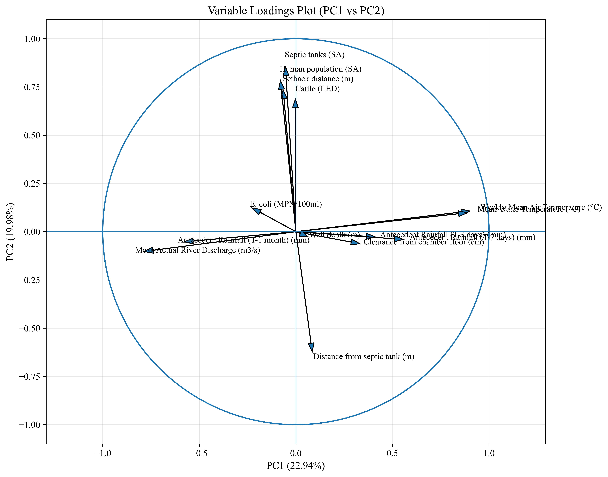
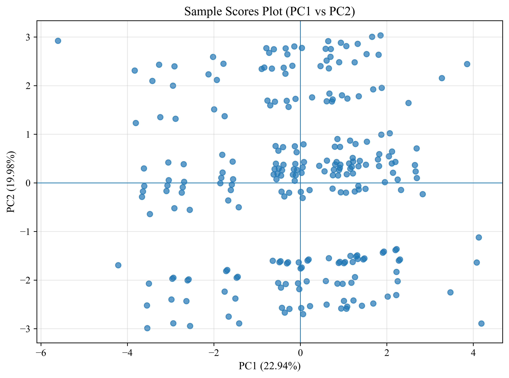
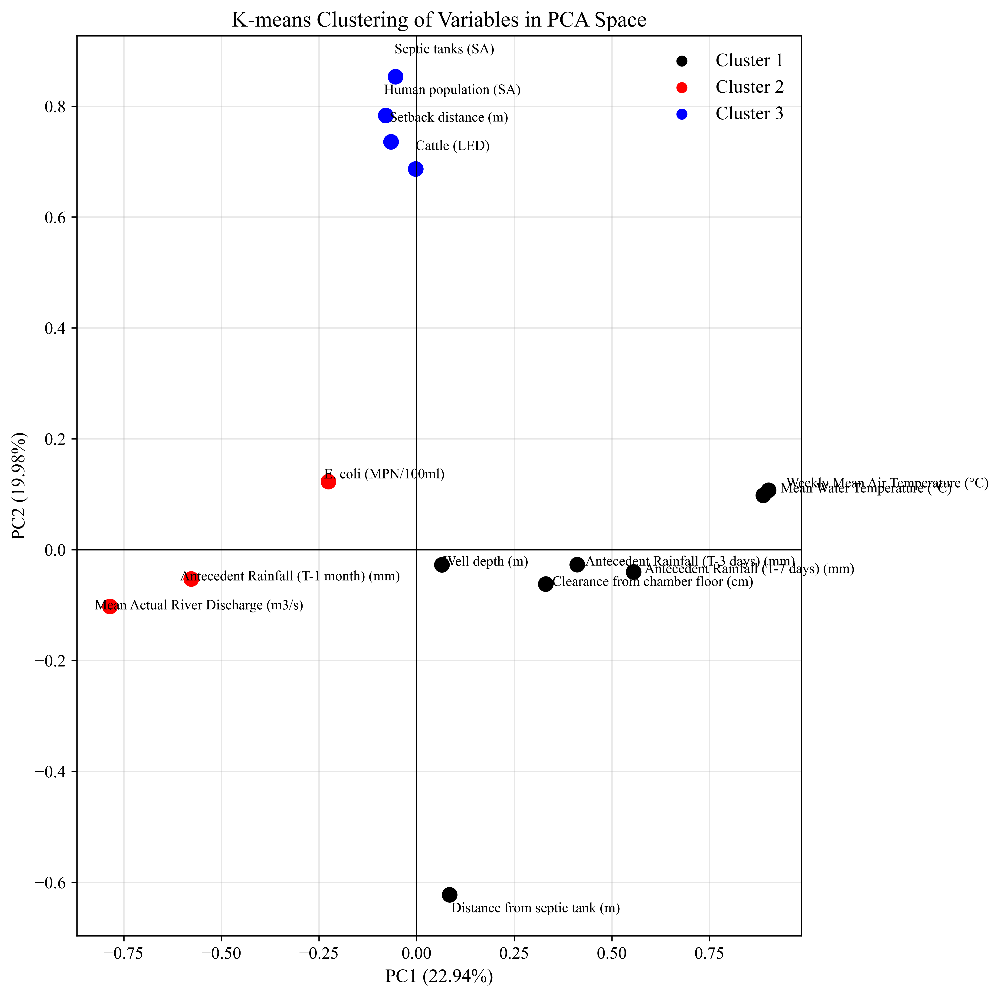

# E. coli Catchment Multivariate Analysis

This repository contains Python workflows for multivariate analysis of *E. coli* concentrations and environmental variables in catchments using:

- Principal Component Analysis (PCA)
- Hierarchical clustering
- K-means clustering
- Visualization of PCA loadings and cluster structures

---

## Research Context

This work supports environmental modelling of microbial contamination in catchments, particularly focusing on:

- Transport and persistence of *E. coli*
- Relationships with hydrological and meteorological variables
- Identification of dominant drivers using dimensionality reduction

---

## Methods

### 1. Data preprocessing
- Standardization (z-score normalization)
- Handling missing values
- Variable selection

### 2. PCA
- Correlation matrix-based PCA  
- Extraction of principal components  
- Interpretation of loadings and explained variance  

### 3. Clustering
- Hierarchical clustering (linkage-based)  
- K-means clustering (variable grouping)  
- Cluster validation via PCA space  

### 4. Visualization
- PCA loading plots  
- Cluster-colored variable maps  
- Scatter plots in PC space  

---

## Example Outputs

### PCA Loading Plot


### PCA Scores Plot


### K-means Variable Clusters


---

## Key Findings

- Rainfall-related variables strongly influence the first principal component (PC1)  
- Temperature variables form a distinct cluster in multivariate space  
- *E. coli* concentrations show strongest association with short-term antecedent rainfall  
- Clustering reveals clear grouping of hydrological vs anthropogenic drivers  

---

## Data Description

The dataset includes:

- *E. coli* concentrations (MPN/100ml)  
- Rainfall (multiple antecedent periods)  
- Air temperature (weekly/monthly)  
- River discharge  
- Land-use indicators (e.g., livestock density, population)  

All variables are standardized prior to analysis.

---

## Workflow

1. Load and preprocess dataset  
2. Standardize variables (z-score normalization)  
3. Perform PCA (correlation matrix)  
4. Extract loadings and scores  
5. Apply clustering:
   - Hierarchical clustering  
   - K-means clustering  
6. Visualize results in PCA space  
7. Export results (Excel + figures)  

---

## Repository Structure
data/
├── raw/
└── processed/

scripts/
├── pca_analysis.py
├── kmeans_clustering.py

results/
└── figures/
├── pca_loading_plot.png
├── pca_scores.png
└── kmeans_clusters.png

README.md
requirements.txt


---

## How to Run

```bash
pip install -r requirements.txt
python scripts/pca_analysis.py
python scripts/kmeans_clustering.py

---

## Author

Majid Bahramian  
Environmental Engineer | Data-Driven Environmental Modelling
